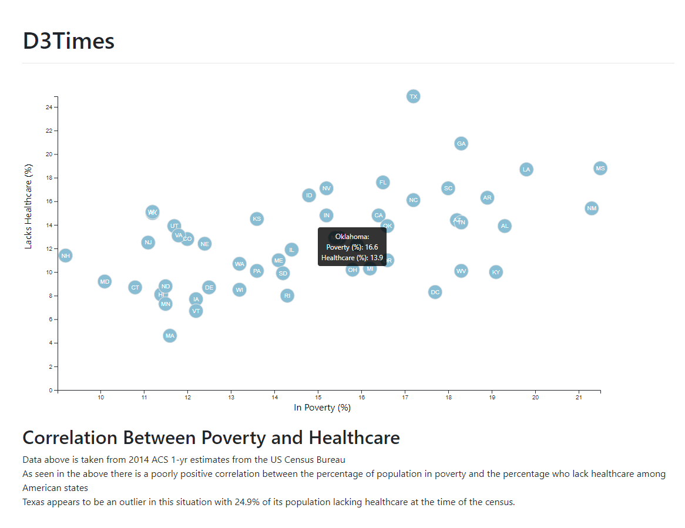

# Health Risks

This project explores health risks in among American states based on 1 yr ACS estimates from the US census bureau. The bonus.html file contains an interactive d3 graph which will allow you to explore the data set

### Technology Used

- D3JS
- CSS
- HTML5

### How it works

- Data is stored in a csv
- csv data is parsed using D3
- An svg area is created on the html page
- Positions of points on the page are determined using the scale function

```javascript
var y_scale = d3.scaleLinear()
        .domain([0, d3.max(data, d => d.healthcare)])
        .range([height, 0]);
```

- Scaled variables are then plotted on the svg in the form of circles on the svg

```javascript
var circles = chart.selectAll("circle")
        .data(data)
        .enter()
        .append("circle")
        .attr("cx", d => x_scale(d.poverty))
        .attr("cy", d => y_scale(d.healthcare))
        .attr("r", "10")
        .classed("stateCircle", true)
```

- Text and axes layers are added

### File Structure

- index.html
  Gives a plot of Healthcare vs Poverty among US States
- app.js
  The javascript file which powers the graph on the index.html file
- bonus.html
  An interactive graph which allows users to explore data by chosing from different x and y axes
- bonus.js
  The javascript file which powers the interactive graph on the bonus.html file

### Demo

These gifs are not my own but are an accurate depiction of how the bonus.html page looks

Interactive Axes


Tooltips


### Screenshots

Example of the index.html

